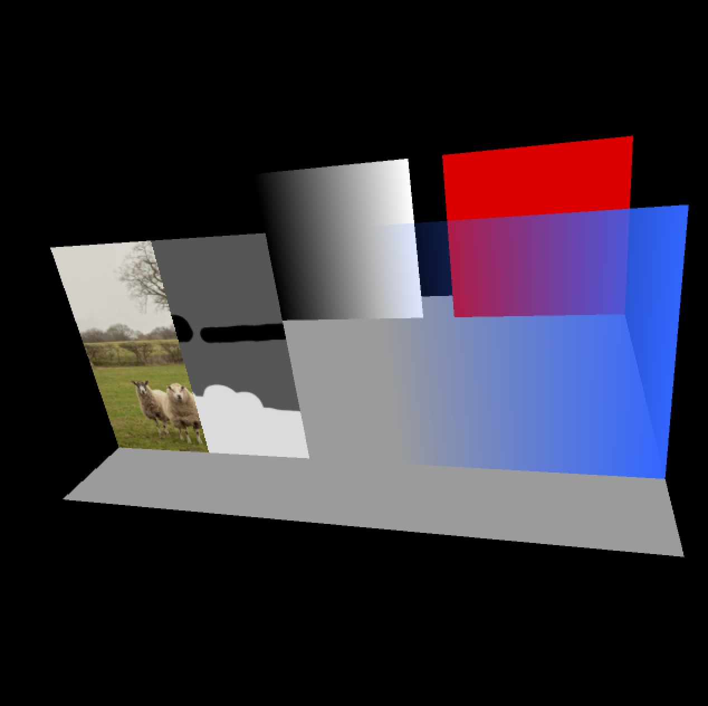
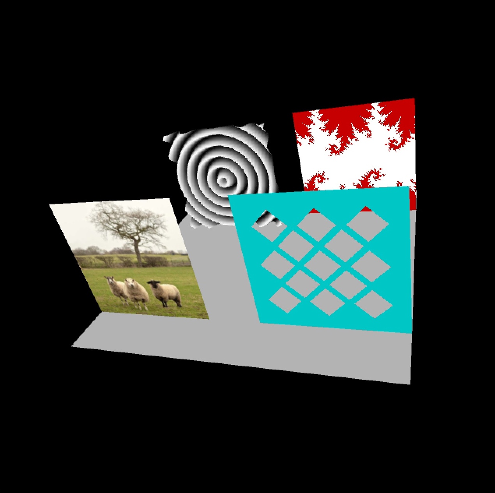
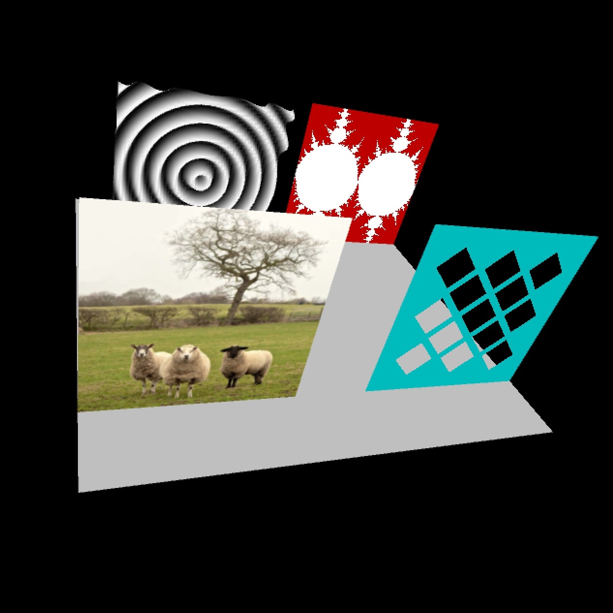
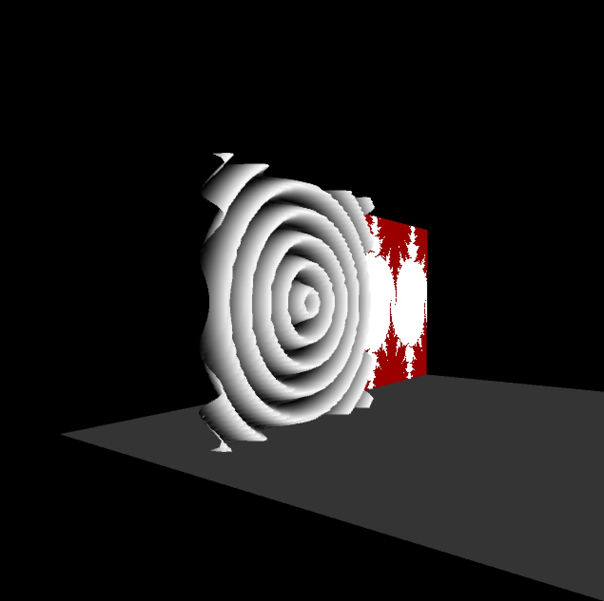
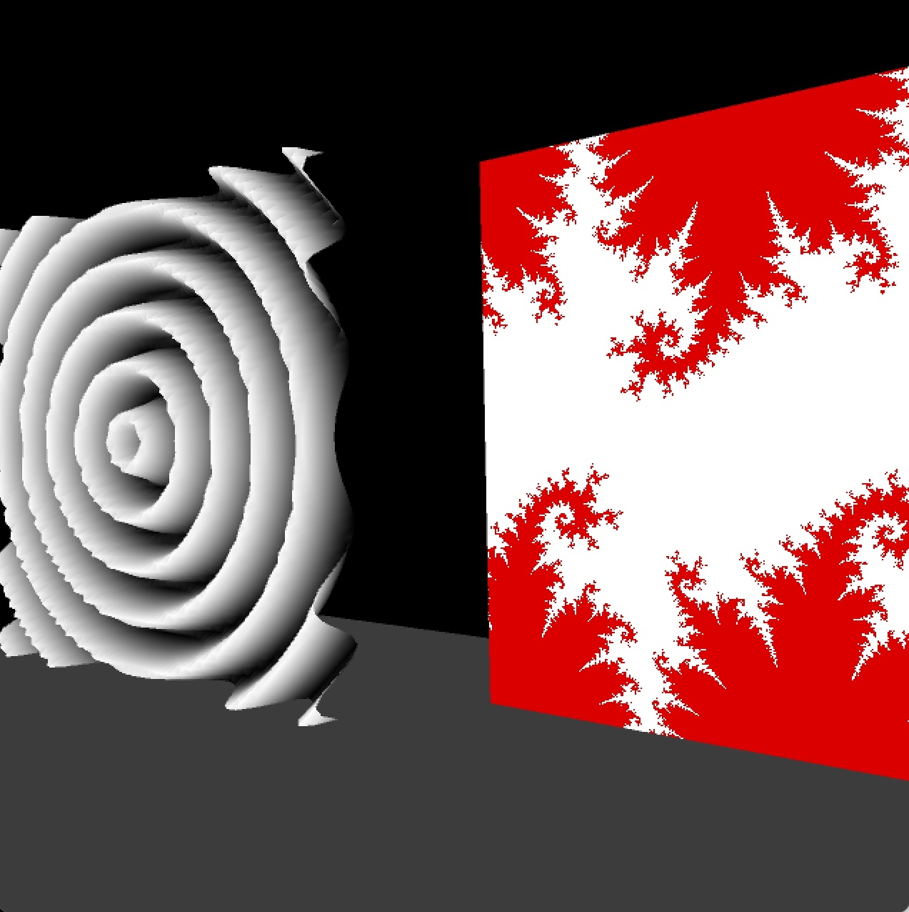

# GPU Image Processing

This project is an implementation of image processing techniques using GPU shaders in C++ and OpenGL. It demonstrates how to use fragment shaders for image manipulation tasks, such as image filtering and edge detection. The project includes a user interface to interact with the shaders and modify the image processing parameters in real-time.

## Features

- GPU-based image processing using OpenGL fragment shaders
- Real-time image manipulation with user interface
- Various image filters (e.g., Gaussian blur, Sobel edge detection)
- Support for custom shaders
- Image loading and saving functionality

## Installation

1. Download and install [OpenGL](https://www.opengl.org/) and [GLUT](https://www.opengl.org/resources/libraries/glut/) libraries for your platform.
2. Clone this repository or download the source code.
3. Build the project using your preferred C++ compiler and development environment.

## Usage

1. Run the compiled executable.
2. The program will open a window displaying the image and a user interface for shader manipulation.
3. Load an image file to apply the image processing techniques using the GPU shaders.
4. Use the interface to select and adjust the filters, and observe the real-time changes on the image.
5. Save the processed image if desired.

For more information on modifying the shaders and image processing techniques, refer to the source code comments.

## Grid of Squares

The first task is to take the translucent blue polygon and modify it so that it has 13 square shaped holes punched through it. You will achieve this by modifying the alpha value on a per-fragment basis, using a fragment program.  You should start by figuring out how to make a single square hole that is aligned with the x and y axes.  Once you know how to create a single square, you should then create the pattern of 13 squares.  Do this while the squares are still horizontally aligned.  The last thing you should do is figure out how to rotate your entire pattern by 45 degrees.

Here are the items we will look for in your square pattern:

Thirteen squares, all the same size.
All of the squares should be rotated 45 degrees from the horizontal.
Match the square placement pattern shown in the results section.
The spacing between the squares should be the same between each pair of adjacent squares.
Mask-Guided Blur

The second task is to perform blurring of an image when the user pressed the "B" key. You will write a GLSL fragment program to perform a number of texture lookups in order to create a blurred version of the given image. We will provide the input image as a texture (a picture of sheep). At each texture coordinate position, you should calculate the average color within a small square of texels surrounding the given texture coordinate position.  Using this average color in region will essentially blur the texture.  At first, you should just blur the entire texture.

Once you can blur the entire texture, then use the intensity of the color in the second texture (the blur mask) to determine how much to blur at each fragment.  The sheep should not be blurred at all, the nearby trees should be blurred a little, and the far trees should be blurred much more.  When the mask value is less than 0.1, you should perform the maximum blur.  When the mask value is between 0.1 and 0.5, you should perform a medium amount of blur.  When the mask value is larger than 0.5, you should not blur at all.

Finally, use the flag "blur_flag" to toggle the blur on and off.  Pressing the key "b" will have the effect of toggling this blur flag between 0 and 1.  We will be testing your code to see whether you properly use this blur flag.

## Ripples

The third task is to write a vertex program to modify the geometry of a collection of polygons. Your task is to replace one of the quads with a “ripple creator”. You will need to subdivide the original quad with many tiny quads by modifying the Processing code in p4_gpu.pde. Note that you will need to subdivide the quad in both x and y directions.  You should subdivide the quad into at least a 40x40 grid, but no more than a 60x60 grid. Then your vertex program will displace these vertices along the normal vector using a sinusoidal pattern that you should create using the distance from the center of the quad.  You can determine how far a given fragment is from the center using the fact that the center of the quad has texture coordinates (s, t) = (0.5 0.5).

Do not move the vertices out of the plane in the p4_gpu.pde file -- this must be done in the vertex shader! You should pass a collection of equal area, planar quads into the shader.

Finally, be sure that your final geometry gets its color from your ripple pattern. To make the color match the geometry better, modify the color so that the peaks of the ripples are white and more distant portions are black.  You can do this by passing an "offset" value between the vertex and the fragment shader.  Such an "offset" parameter has already been defined in the two shaders, you just need to set it in one and use it in the other.

## Fractal

The final task is to draw a fractal that is based on the sine of complex numbers. You will take one of the squares from the example code and modify it so that you display a white fractal set on some colored background (red in the example below). The colors (and possibly color bands) for the background are for you to decide. Let z_new = c * sin(z), where z and c are both complex numbers, and where * denotes complex multiplication.  Note that this equation takes the sine of a complex number, and the rule for this is sin(z) = sin(z.re) * cosh(z.im) + i * cos(z.re) * sinh(z.im), where z.re and z.im are the real and imaginary parts of z, respectively.

We will be making a map of what happens when using one value for c, but different starting values for z (which correspond to different locations in the plane). For some given value for c, let z(0) = some position in the complex plane, and look at the values z_1 = c * sin(z_0), z_2 = c * sin(z_1), and so on. Plugging the result of a function back into itself is called an iteration. If these iterated values stay near zero (never leave a circle of radius 50), then draw a white pixel at the location for z_0. If the values do leave the circle, color them something else (e.g. red). Do this for all the values for values of z such that z.real is in the range [-3.14, 3.14] and z.imaginary is in [-3.14, 3.14]. The result is the fractal set that we want. Use at least 20 iterations of the function to create your fractal set.

The value of c will be handed to your program through these two lines of Java (already present in the example code):

fractal_shader.set ("cx", cx);
fractal_shader.set ("cy", cy);

Since the value of "time" will change, this means your fractal set will change over time.

Note that this fractal is not the classic Mandelbrot or Julia set from the equation z_new = z ^2 + c.  You will get no credit for creating this other more common fractal.Here is a web page by Paul Bourke that describes this fractal in slightly more detail:

http://paulbourke.net/fractals/sinjulia/ 

If you want to understand how sin(z) behaves, you can check out this web page:

https://www.geogebra.org/m/qtwNw524 

# Images: Initial and Final Results
The first image below shows what the example code should show on the screen when you run it. If you run the provided code and do not see sheep on the left and a translucent blue card on the right, your graphics card is probably very old. If this turns out to be the case, please seek out the another computer to use.

Below are the kinds of images that your program should make when you have successfully completed the assignment.

Below are close-up shots of the sheep image.  The first such image shows the un-altered original image.  The second one is subtly different, as the background has been blurred to give the appearance of greater depth of field.  The effect is the most noticeable around the trees and bushes.

Here are some close-up images of the ripples, showing how the geometry is no longer flat, due to manipulation of vertex coordinates in the vertex shader.

## Programming Resources
https://processing.org/tutorials/pshader/
http://nehe.gamedev.net/article/glsl_an_introduction/25007/
http://www.lighthouse3d.com/tutorials/glsl-tutorial/
