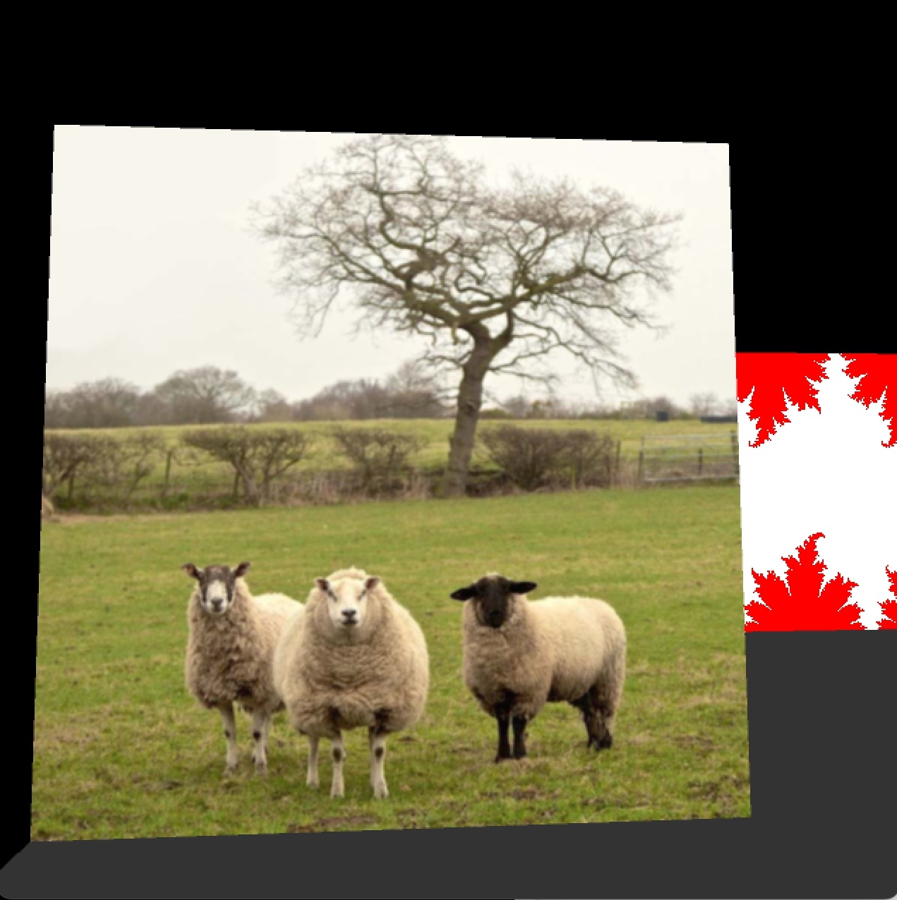
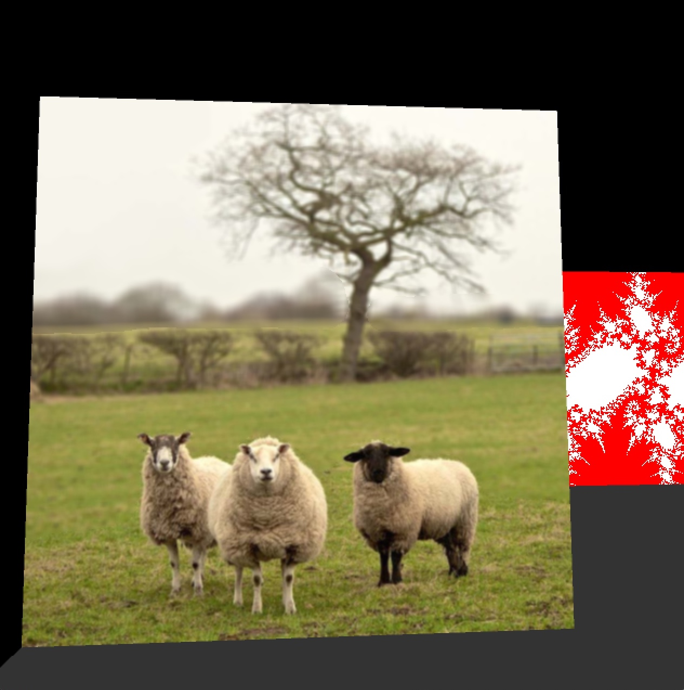

# Project 4: GPU Programming

The purpose of this project is to use the GPU (vertex and fragment processors) to carry out various rendering tasks. You will write three short fragment programs that create various patterns and textures.  In addition, you will write one vertex program that will change the geometry of a simple surface.  Note that unlike previous assignments, this one is not divided into part A and part B.  Also unlike previous projects, you will program mostly in GLSL, and a little bit in Java (.pde files).

# Project Description
The code that you create will take the simple examples we provide and modify them to carry out a set of tasks. Here is a list of the four tasks:

## Grid of Squares

The first task is to take the translucent blue polygon and modify it so that it has 13 square shaped holes punched through it. You will achieve this by modifying the alpha value on a per-fragment basis, using a fragment program.  You should start by figuring out how to make a single square hole that is aligned with the x and y axes.  Once you know how to create a single square, you should then create the pattern of 13 squares.  Do this while the squares are still horizontally aligned.  The last thing you should do is figure out how to rotate your entire pattern by 45 degrees.

Here are the items we will look for in your square pattern:

Thirteen squares, all the same size.
All of the squares should be rotated 45 degrees from the horizontal.
Match the square placement pattern shown in the results section.
The spacing between the squares should be the same between each pair of adjacent squares.
Mask-Guided Blur

The second task is to perform blurring of an image when the user pressed the "B" key. You will write a GLSL fragment program to perform a number of texture lookups in order to create a blurred version of the given image. We will provide the input image as a texture (a picture of sheep). At each texture coordinate position, you should calculate the average color within a small square of texels surrounding the given texture coordinate position.  Using this average color in region will essentially blur the texture.  At first, you should just blur the entire texture.

Once you can blur the entire texture, then use the intensity of the color in the second texture (the blur mask) to determine how much to blur at each fragment.  The sheep should not be blurred at all, the nearby trees should be blurred a little, and the far trees should be blurred much more.  When the mask value is less than 0.1, you should perform the maximum blur.  When the mask value is between 0.1 and 0.5, you should perform a medium amount of blur.  When the mask value is larger than 0.5, you should not blur at all.

Finally, use the flag "blur_flag" to toggle the blur on and off.  Pressing the key "b" will have the effect of toggling this blur flag between 0 and 1.  We will be testing your code to see whether you properly use this blur flag.

## Ripples

The third task is to write a vertex program to modify the geometry of a collection of polygons. Your task is to replace one of the quads with a “ripple creator”. You will need to subdivide the original quad with many tiny quads by modifying the Processing code in p4_gpu.pde. Note that you will need to subdivide the quad in both x and y directions.  You should subdivide the quad into at least a 40x40 grid, but no more than a 60x60 grid. Then your vertex program will displace these vertices along the normal vector using a sinusoidal pattern that you should create using the distance from the center of the quad.  You can determine how far a given fragment is from the center using the fact that the center of the quad has texture coordinates (s, t) = (0.5 0.5).

Do not move the vertices out of the plane in the p4_gpu.pde file -- this must be done in the vertex shader! You should pass a collection of equal area, planar quads into the shader.

Finally, be sure that your final geometry gets its color from your ripple pattern. To make the color match the geometry better, modify the color so that the peaks of the ripples are white and more distant portions are black.  You can do this by passing an "offset" value between the vertex and the fragment shader.  Such an "offset" parameter has already been defined in the two shaders, you just need to set it in one and use it in the other.

## Fractal

The final task is to draw a fractal that is based on the sine of complex numbers. You will take one of the squares from the example code and modify it so that you display a white fractal set on some colored background (red in the example below). The colors (and possibly color bands) for the background are for you to decide. Let z_new = c * sin(z), where z and c are both complex numbers, and where * denotes complex multiplication.  Note that this equation takes the sine of a complex number, and the rule for this is sin(z) = sin(z.re) * cosh(z.im) + i * cos(z.re) * sinh(z.im), where z.re and z.im are the real and imaginary parts of z, respectively.

We will be making a map of what happens when using one value for c, but different starting values for z (which correspond to different locations in the plane). For some given value for c, let z(0) = some position in the complex plane, and look at the values z_1 = c * sin(z_0), z_2 = c * sin(z_1), and so on. Plugging the result of a function back into itself is called an iteration. If these iterated values stay near zero (never leave a circle of radius 50), then draw a white pixel at the location for z_0. If the values do leave the circle, color them something else (e.g. red). Do this for all the values for values of z such that z.real is in the range [-3.14, 3.14] and z.imaginary is in [-3.14, 3.14]. The result is the fractal set that we want. Use at least 20 iterations of the function to create your fractal set.

The value of c will be handed to your program through these two lines of Java (already present in the example code):

fractal_shader.set ("cx", cx);
fractal_shader.set ("cy", cy);

Since the value of "time" will change, this means your fractal set will change over time.

Note that this fractal is not the classic Mandelbrot or Julia set from the equation z_new = z ^2 + c.  You will get no credit for creating this other more common fractal.Here is a web page by Paul Bourke that describes this fractal in slightly more detail:

http://paulbourke.net/fractals/sinjulia/ 

If you want to understand how sin(z) behaves, you can check out this web page:

https://www.geogebra.org/m/qtwNw524 

# Provided Code
Download the PROVIDED CODE Download PROVIDED CODE that includes a regular Processing file in Java, as well as several vertex and fragment shaders in the data folder.  **Important Note:**  The provided code is for Processing Version 3.  If you are using Processing Version 4, you will have to change the call getCount() to getAmount() at the last line of the p4_gpu.pde file.

# Images: Initial and Final Results
The first image below shows what the example code should show on the screen when you run it. If you run the provided code and do not see sheep on the left and a translucent blue card on the right, your graphics card is probably very old. If this turns out to be the case, please seek out the another computer to use.

Below are the kinds of images that your program should make when you have successfully completed the assignment.

Below are close-up shots of the sheep image.  The first such image shows the un-altered original image.  The second one is subtly different, as the background has been blurred to give the appearance of greater depth of field.  The effect is the most noticeable around the trees and bushes.

Here are some close-up images of the ripples, showing how the geometry is no longer flat, due to manipulation of vertex coordinates in the vertex shader.

# Programming Suggestions
We recommend starting this project by working on the Grid of Squares pattern sub-project.  First, try to modify the example code to make a transparent slot (alpha = 0) in the middle of the card.  Do this by making use of the x value of the texture coordinates to help you modify the alpha value.  Then, see if you can make a single un-rotated square in the middle of the card, with its edges running horizontally and vertically (not diagonally).  Next, create multiple of these squares.  Finally, figure out how to rotate your entire pattern by 45 degrees by modifying the texture coordinates before you begin to use them to make your squares.

We provide example code for this project in the accompanying zip file. This example program draws four quads upright on a ground plane. Moving the mouse in the window rotates the view of this scene.  The space bar locks or unlocks the scene position, and the scroll wheel zooms in and out.

You should tackle this assignment by modifying the fragment and vertex code to carry out the tasks listed above. One by one, you should modify the simple polygons that we provide into much more beautiful polygons that show off the power of GLSL programming. The key to success in programming GLSL is to make small changes to working code, and verify that each of your changes does what you expect. Do not expect to write an entire GLSL program from scratch, replace the example code, and have it work beautifully the first time. Debugging GLSL code is an art. You can't single-step through GLSL code, you can't set breakpoints, and you can't print out intermediate values. Your only form of output from GLSL programs is the resulting image you see on the screen. To debug, you must make clever use of the framebuffer to display intermediate values as pixel colors. Don't forget that pixel colors must be in the range of zero to one.

There are four fragment programs, and they have names “X.frag”, where X is a word describing the task. These programs are in the sub-directory called “data”, and must remain there for the Processing program to find them. You will need to modify some of these to create the necessary fragment shaders for the four tasks. Processing does not know that these files are code, and so you cannot modify them from within the Processing development environment. You should edit them using any text editor that supports plain text files. As mentioned above, we suggest that you start by modifying square.frag for the circle example because it already shows how to modify the alpha channel (transparency). The file image_manip.frag uses an image of sheep. You should write your blur program based on this code.  Create your fractal by modifying fractal.frag.

There are four examples of vertex programs, and they are called X.vert. These are also in the sub-directory “data”, and should stay there. Modify bumps.vert for the ripple creation task.

# Programming Resources
You can find details about using shaders in Processing at the following web page:

    https://processing.org/tutorials/pshader/

The material from the lectures and in the above Processing link should be sufficient to finish this assignment.  For those who are interested in more information, here are some additional tutorials on GLSL:

    http://nehe.gamedev.net/article/glsl_an_introduction/25007/
    http://www.lighthouse3d.com/tutorials/glsl-tutorial/

Authorship Rules
The code that you turn in entirely your own. You are allowed to talk to other members of the class and to the instructor and the TA’s about general implementation of the assignment. It is also fine to seek the help of others for general Processing/Java/GLSL programming questions. You may not, however, use code that anyone other than yourself has written. The only exception is that you should use the source code that we provide for this project. Code that is explicitly not allowed includes code taken from the Web, from github, from other students, from books, from other assignments or from any source other than yourself. You should not show your code to other students. Feel free to seek the help of the instructor and the TA's for suggestions about writing and debugging your code.

# Submission
In order to run the source code, it must be in a folder named after the main file. When submitting any assignment, leave it in this folder, zip it and submit via Canvas.  Please do not use tar or rar to turn in your files.